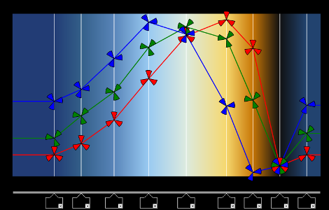

Demo & Tutorial: Angular2 with Typescript
=============

# Intro

This repository introduces useful angular2 components which mimic behaviors found on many 
web sites and implemented with javascript using jquery or bootstrap frameworks.
A live demo is available here: http://meandemo.github.io.

# Features 

1. Our first demo shows how a sticky div or sticky navbar behavior can be achieved with a simple angular2 component.
2. A Second demo demonstrates a slider component implemented using SVG which can be easily customized.
   We present horizontal and vertical sliders
3. In the third demo, the runners can be added and removed dynamically. We use a different way to communicate between
   components: instead of the bi-directional property binding, the slider subscribes to a service. 
4. The gradient demo combines all the components seen so far: sliders, vertical sliders, dynamic sliders, services.
   This demo also uses html5 canvas.  
   

# Changes

### 20-jan-2016:
Added a gradient demo, works fine.
We have also updated the error handling: an API allows the error page to display in the url with triggered the 404 error.   

### 18-jan-2016:
Further refactoring to prepare the fourth demo.
Addition of error page to catch 404 errors.
This does not work on githup.io as it's a fully static server.
Replaced nodemon by forever. 

### 14-jan-2016:
Refactoring  part of the code for to facilitate  reuse.
Added slider orientation, demo in RGB slider. 

### 12-jan-2016:
The code has been aligned with NG2 version 2.0.0-beta.1
Minor fixes. The minified versions trigger a un-identified bug. 
Added dynamic multi runner slider.

### 8-jan-2016:
The code has been aligned with NG2 version 2.0.0-beta.0
We are using production mode to avoid the 'has changed after it was checked' error messages. 

# Getting Started

1. clone this repository

2. `npm install`

3. `tsd reinstall --save --overwrite`

4. `gulp init`

4. `gulp run`

5. open web page on http://localhost:8080, don't forget to activate the livereload button

# Details

## A Sticky div

Our first angular2 component is a sticky div, found on many web sites ( http://www.w3schools.com/w3css).
This implementation relies on angular2 framework exclusively.

The web page has all the information, enjoy! 

## An SVG Slider

Using the power of angular2, we demonstrate an SVG based slider which can be easily customized to fit
your needs.

## RGB Color selector using SVG Slider

An extension of the SVG Slider with 3 runners on the rail is the basis for this interesting RGB color
selector. In addition, we have a good example of form control with ngControl, and communication between
3 components: slider, individual color input and hex color input.

## Dynamic multi runner slider

Another extension of the SVG Slider with any number of runners which can be updated, added and removed.
We are using a service to communicate between parent and child.

## Misc Info

Tested ok on Chrome 47.0.2526.80 m & win7 

## Warning

If you are using cygwin, you will have to open a powershell terminal for all the above steps.
I ran into trouble with nodemon when launching from patty.  
