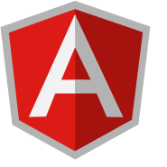
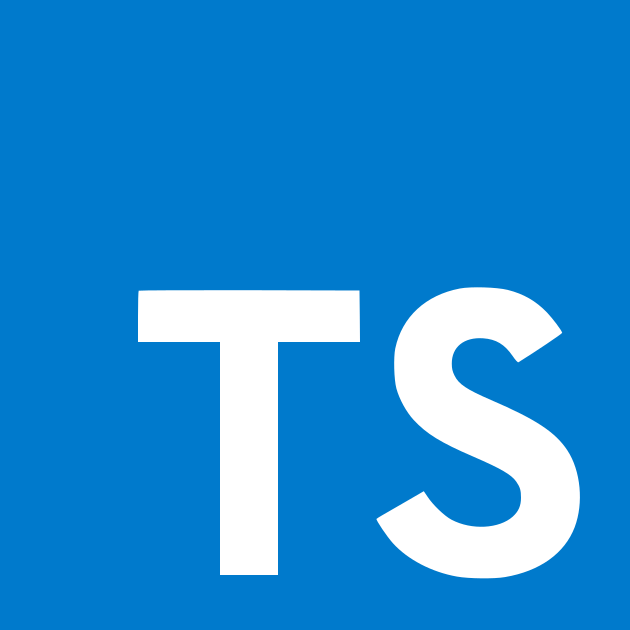

Demo & Tutorial: Angular2 with Typescript
=============

      

# Intro

This repository introduces useful angular2 components which mimic behaviors found on many web sites and implemented with javascript using jquery or bootstrap frameworks.

Our first demo shows how a sticky div or sticky navbar behavior can be achieved with a simple angular2 component.

# Getting Started

1. clone this repository

2. `npm install`

3. `tsd reinstall --save --overwrite`

3. `gulp init`

4. `gulp demo`

5. open web page on http://localhost:8080, don't forget to activate the livereload button

## Beware

If you are using cygwin, you will have to open a powershell terminal for all the above steps.
I ran into trouble with nodemon when launching from patty.  

# Features

A live demo is available [rfu].

## A sticky div

Our first angular2 component is a sticky div, found on many web sites ( http://www.w3schools.com/w3css).
This implementation relies on angular2 framework exclusively.

The web page has all the information, enjoy! 

Tested ok on Chrome 47.0.2526.80 m & win7 
